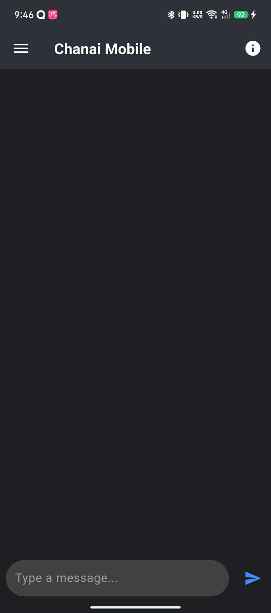
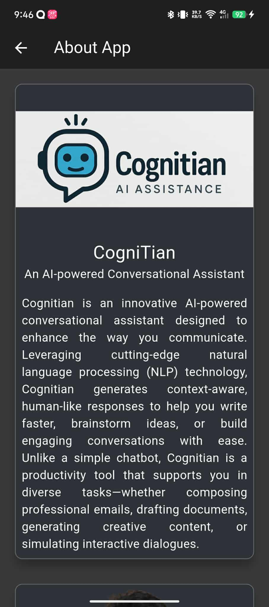

# chanai_mobile

A new Flutter project.

## Project Overview

This project is a mobile application that showcases the various features of Flutter. It includes a home page with a list of items, a drawer for navigation, and an information page with details about the project.

## Sample Images

The following images show the various pages of the application.

### Home Page

### Drawer

### Information Page

### Sample Response

### History

## Sample Video

The following video shows the application in action.

## Getting Started

This project is a starting point for a Flutter application.

A few resources to get you started if this is your first Flutter project:

- [Lab: Write your first Flutter app](https://docs.flutter.dev/get-started/codelab)
- [Cookbook: Useful Flutter samples](https://docs.flutter.dev/cookbook)

For help getting started with Flutter development, view the
[online documentation](https://docs.flutter.dev/), which offers tutorials,
samples, guidance on mobile development, and a full API reference.

